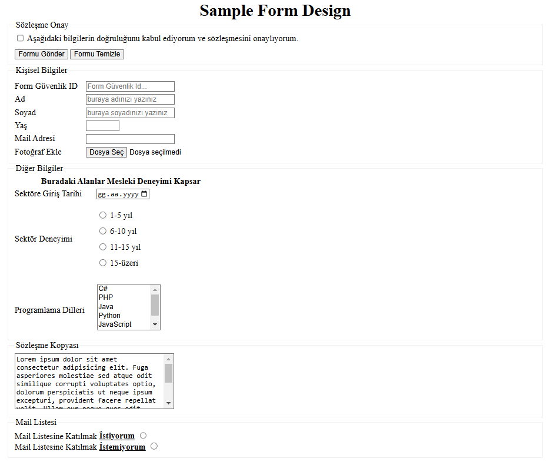

<h1 align="center">Sample Form Design</h1>



## 📌 Overview
This project presents a **sample form design** created with HTML and CSS. The form is structured to be visually appealing and user-friendly, following best practices for modern web design.

## 🚀 Features
- Fully responsive design 📱💻
- Clean and minimal UI ✨
- Well-structured HTML & CSS 🏗️
- Easy to customize 🎨

## 🛠️ Technologies Used
- **HTML5** for the structure
- **CSS3** for styling
- **Bootstrap (if applicable)** for responsiveness

## 📷 Preview
Here is a preview of the form design:


## 📂 Installation & Usage
To use this form design, follow these steps:

1. Clone the repository:
   ```sh
   git clone https://github.com/your-username/sample-form-design.git
   ```
2. Open the `index.html` file in your browser.

## 🎯 How to Customize
- Modify the **HTML structure** in `index.html` as needed.
- Update **CSS styles** in `style.css` to match your brand or theme.
- Add **JavaScript** if you need interactive form validations.

## 📌 Contributing
Contributions are welcome! Feel free to fork this project and submit pull requests. 😊

## 📄 License
This project is licensed under the **MIT License** – feel free to use and modify it.

---
✨ **Designed with simplicity and functionality in mind!** ✨

